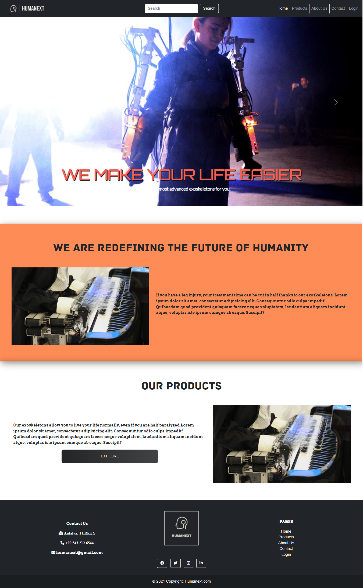
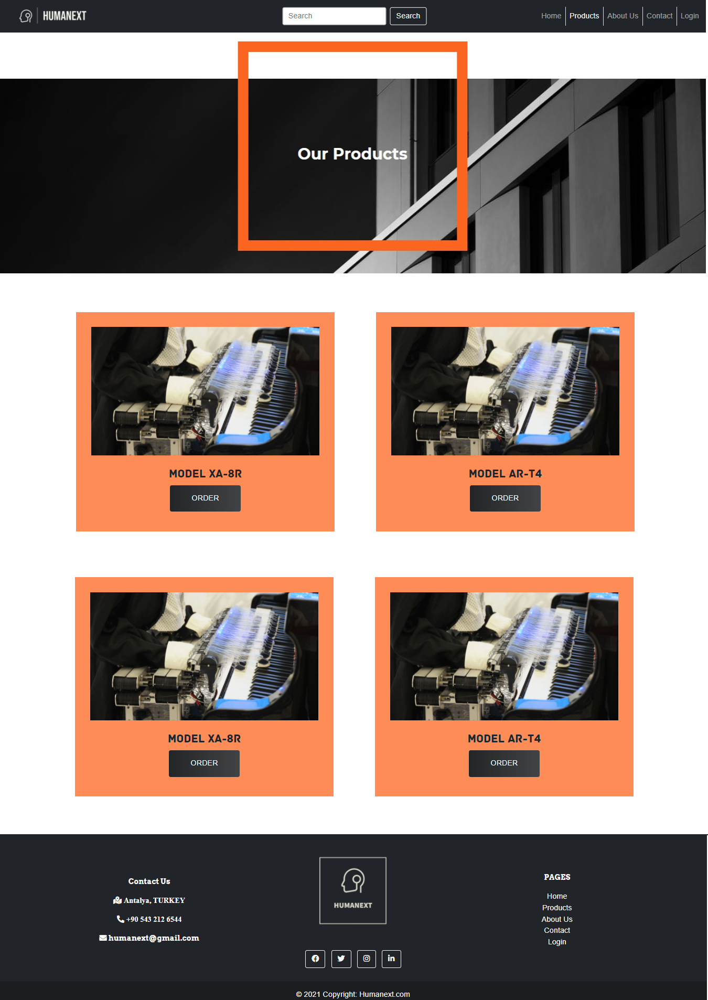

# HUMANEXT WEBSITE

> The humanext project was established to provide an artificial arm to the patient in cases of war, accident or congenital disabilities, such as the loss of the patient's arm, or to provide extensions to support the body for patients with paralysis.

## Description

This project was made for the UI course at the university. Therefore, it is only design-oriented and does not have any backend processes. Some screenshots from the site:

## Contributing

Pull requests are welcome. For major changes, please open an issue first to discuss what you would like to change.

Have a nice try!

If you run into a problem, you can let me know here or on my Twitter account. - [@Mehmetkaragoz07](https://twitter.com/Mehmetkaragoz07) - karagoz.mhmtg@gmail.com

https://github.com/mehmet-karagoz
